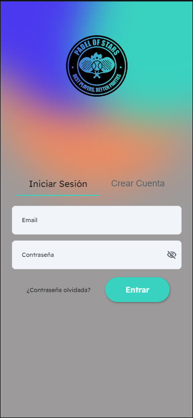
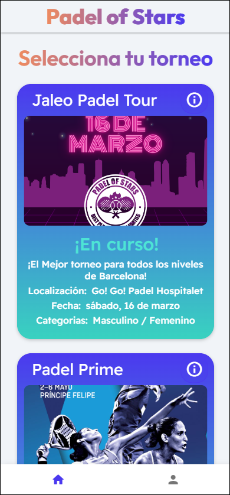
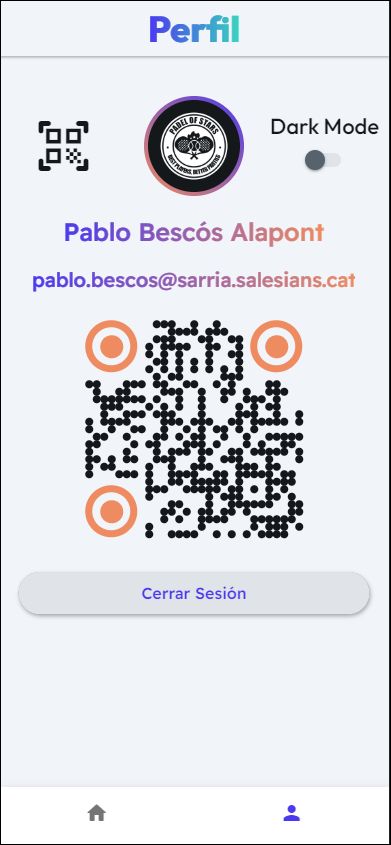
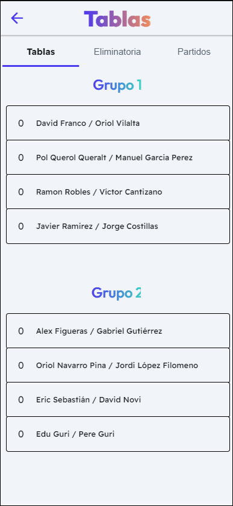
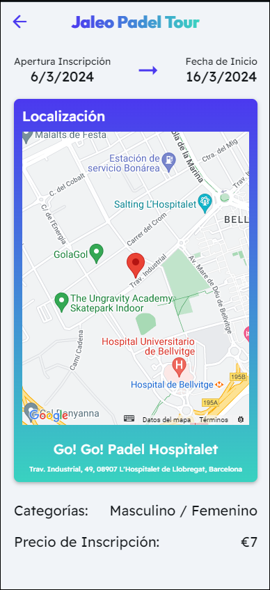

# Padel Of Stars

¡Bienvenido a Padel Of Stars!

Padel Of Stars es una aplicación móvil diseñada para mejorar la experiencia de los torneos de pádel y potenciar el aspecto social pre y post partido. Nuestros objetivos principales incluyen:

- Mejorar la experiencia del Torneo promedio de Padel.
- Potenciar el aspecto social pre/post-partido (Bar, Fiesta, Eventos…).
- Fomentar la deportividad y el buen rollo entre los jugadores.
- Crear Torneos accesibles para todo tipo de jugadores (+- competitivo).
- Proporcionar una herramienta fácil para el seguimiento de los torneos.

## ¿Cómo usar la aplicación?

1. **Registro o inicio de sesión:**
   - Si eres nuevo en Padel Of Stars, regístrate con tu dirección de correo electrónico o inicia sesión si ya tienes una cuenta.
   - 

2. **Explorar torneos:**
   - Una vez que hayas iniciado sesión, verás una pantalla principal donde podrás encontrar una lista de los torneos disponibles.
   - 
   
3. **Perfil de usuario:**
   - Si haces clic en el icono de perfil, podrás acceder a tu perfil de usuario donde podrás ver tu información personal y tus estadísticas.
   - 

4. **Clasificaciones:**
   - Puedes ver la clasificación de cada jugador en los torneos para evaluar tu posición y la de tus amigos.
   - 

5. **Detalles del torneo:**
   - Si deseas obtener más información sobre un torneo específico, puedes acceder a una página dedicada para ver detalles como fechas, ubicaciones, premios, etc.
   - 

¡Y eso es todo! Con Padel Of Stars, mejorarás tu experiencia en los torneos de pádel y disfrutarás de un ambiente social increíble tanto dentro como fuera de la cancha. ¡Diviértete jugando!
